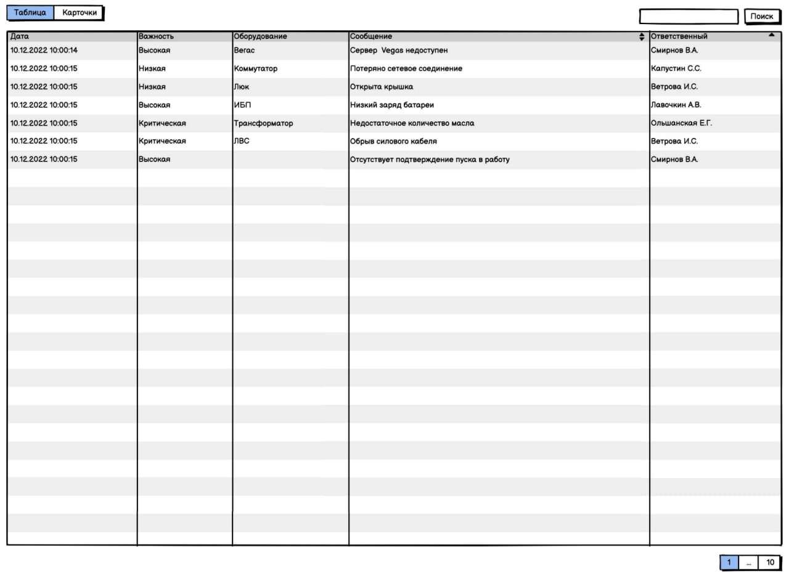
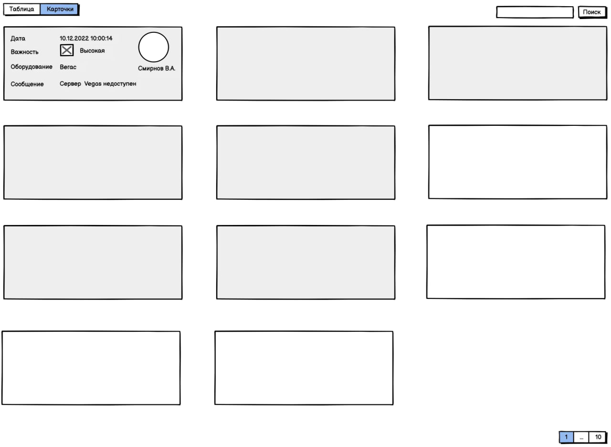

# Задание

### Написать одностраничное приложение <i>"Журнал событий"</i>.

Необходимо использовать <i><strong>Vue.js 3</strong></i> и <i><strong>PrimeVue</strong></i> или <i><strong>React</strong></i> и <i><strong>PrimeReact</strong></i>.

Предпочтительно использовать <i><strong>TypeScript</strong></i>.

Реализовать следующие требования:

- Просмотр списка событий в виде карточек или в виде таблицы
- Возможность отметить событие прочитанным
- По умолчанию события добавляются непрочитанными
- Реализовать прочтение карточки путем выбора карточки и нажатия клавиши <i><strong>пробел</strong></i>
- Прочитанная карточка должна визуально отличаться от непрочитанной
- Страница должна быть без вертикальной прокрутки - реализовать
  пагинацию
- Сообщения в список добавлять по таймеру
- Реализовать поиск по тексту сообщения
- Реализовать адаптивность под разные размеры экранов

---

  
  

---

### Задача выполнена с использованием <i>Vue 3</i>, <i>VueX 4</i>, <i>Options API</i>, <i>TypeScript</i>, <i>PrimeVue</i> и <i>SCSS</i>.

События в массив событий добавляются автоматически раз в 3 секунды. Значения генерируются случайным образом из заранее заготовленного списка возможных вариантов.
За хранение массива событий, условий фильтрации и внешнего вида таблицы отвечает <i><strong>VueX 4</strong></i>. Для кэширования и оптимизации применяются `getters`, данные нигде не используются в "сыром" виде. В любом месте приложения работающим с данными, они забираются из геттера, что позволяет уменьшить количество вычислений и нагрузку на клиент.

Реализованы следующие дополнительные возможности:

- Выбор области поиска.
- - по конкретному полю
- - по всем полям
- Скрывать все просмотренные события
- Выбор всех событий сразу
- Блокировка события `keydown` во время ввода поискового запроса

---

# <i>[Решение](https://event-tracker-f4wy.onrender.com)</i>
